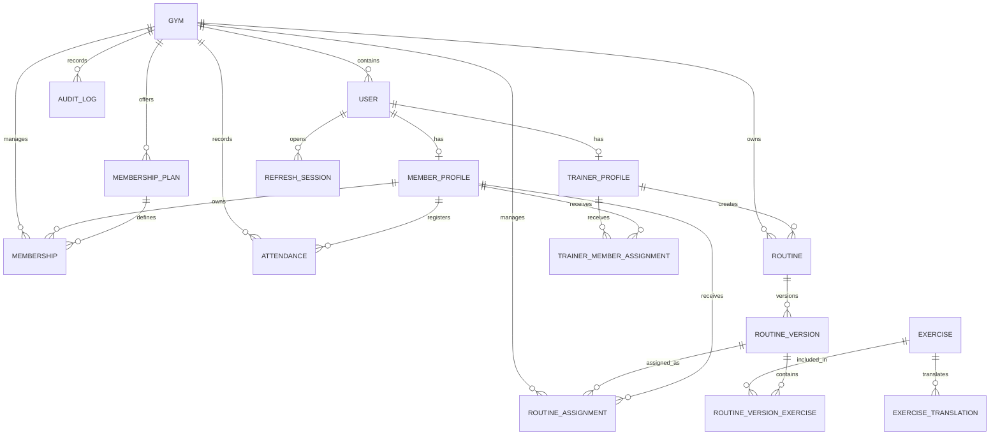

# GymFlow — Modelo de datos y relaciones

> Estado: diseño aprobado a nivel conceptual. Este documento todavía no es un schema de Prisma ni una migración.

## 1. Decisiones base

El modelo se diseña con estas decisiones:

- PostgreSQL como base de datos.
- Prisma como ORM.
- Arquitectura single-tenant preparada para evolucionar.
- Una entidad `Gym` desde el inicio.
- Los recursos operativos incluyen `gymId`.
- Moneda inicial USD.
- Zona horaria inicial `America/Guayaquil`.
- Identificadores UUID.
- Fechas almacenadas en UTC.
- Soft delete o desactivación solamente donde tenga sentido.
- Historial operativo preservado.
- Datos ficticios para la demo pública.

Prisma soporta relaciones uno a uno, uno a muchos y muchos a muchos. Cuando una relación contiene datos propios, debe representarse mediante un modelo explícito en lugar de una relación many-to-many implícita.

Referencias:

- [Prisma: relaciones](https://www.prisma.io/docs/orm/prisma-schema/data-model/relations)
- [Prisma: modelado de datos](https://www.prisma.io/docs/orm/core-concepts/data-modeling)
- [Prisma: índices](https://www.prisma.io/docs/orm/prisma-schema/data-model/indexes)

## 2. Alcance del modelo

### Incluido en el MVP

- Gimnasio.
- Usuarios.
- Perfiles de miembros.
- Perfiles de entrenadores.
- Sesiones renovables.
- Asignación entrenador-miembro.
- Planes.
- Membresías.
- Asistencias.
- Ejercicios.
- Traducciones de ejercicios.
- Rutinas.
- Versiones de rutinas.
- Ejercicios de una versión.
- Asignaciones de rutinas.
- Auditoría básica.

### Pospuesto

- Pagos reales.
- Facturas.
- Clases grupales.
- Reservas.
- Notificaciones.
- Archivos.
- Mensajería.
- Multi-sede.
- Suscripción SaaS del gimnasio.
- Progreso corporal y rendimiento detallado.

No se crearán tablas para funcionalidades futuras hasta que existan reglas y casos de uso aprobados.

## 3. Convenciones

### Identificadores

Se utilizarán UUID para:

- Evitar IDs secuenciales expuestos.
- Facilitar importación y sincronización.
- Mantener independencia entre entornos.

El ID externo del dataset de ejercicios nunca será la primary key de GymFlow.

### Fechas

Todos los timestamps se almacenan en UTC.

Campos comunes:

```text
createdAt
updatedAt
```

Campos históricos pueden incluir:

```text
createdById
updatedById
cancelledAt
cancelledById
deactivatedAt
```

No todas las entidades necesitan todos estos campos.

### Dinero

Los precios se almacenan como decimal, nunca como `float`.

Una cantidad monetaria debe incluir:

- Valor.
- Moneda.

Para el MVP se puede admitir una única moneda operativa, pero la membresía conserva la moneda contratada.

### Estados

Los estados con un conjunto cerrado se representan mediante enums.

No se utilizarán strings libres para estados críticos.

## 4. Diagrama general



## 5. Gym

Representa el gimnasio dentro del cual existen los datos operativos.

### Campos conceptuales

| Campo | Tipo conceptual | Regla |
| --- | --- | --- |
| `id` | UUID | Primary key |
| `name` | String | Obligatorio |
| `slug` | String | Único |
| `timezone` | String | `America/Guayaquil` inicialmente |
| `currency` | String | `USD` inicialmente |
| `status` | Enum | Activo o inactivo |
| `createdAt` | Timestamp | UTC |
| `updatedAt` | Timestamp | UTC |

### Reglas

- La demo tendrá un solo registro.
- Un gimnasio inactivo no acepta nuevas operaciones.
- `timezone` permite presentar fechas correctamente y comienza como `America/Guayaquil`.
- `currency` define la moneda por defecto de los planes y comienza como `USD`.

### Estado

```text
ACTIVE
INACTIVE
```

## 6. User

Representa identidad, autenticación y autorización.

No contiene todos los datos de miembro o entrenador.

### Campos conceptuales

| Campo | Tipo conceptual | Regla |
| --- | --- | --- |
| `id` | UUID | Primary key |
| `gymId` | UUID | Foreign key |
| `email` | String | Único y normalizado |
| `passwordHash` | String | Nunca se expone |
| `role` | Enum | Rol inicial |
| `status` | Enum | Estado de acceso |
| `emailVerifiedAt` | Timestamp opcional | Fuera del flujo inicial |
| `lastLoginAt` | Timestamp opcional | Auditoría |
| `createdAt` | Timestamp | UTC |
| `updatedAt` | Timestamp | UTC |
| `deactivatedAt` | Timestamp opcional | Desactivación |

### Rol

```text
ADMIN
TRAINER
MEMBER
```

### Estado

```text
ACTIVE
INACTIVE
```

### Reglas

- El correo se almacena normalizado.
- La unicidad inicial del correo será global.
- Un usuario pertenece a un gimnasio.
- Un usuario inactivo no puede iniciar ni renovar sesión.
- El rol no sustituye la validación de alcance.
- Un `MEMBER` debe tener un `MemberProfile`.
- Un `TRAINER` debe tener un `TrainerProfile`.
- Un `ADMIN` no necesita perfil adicional en el MVP.

### Índices

- Unique por `email`.
- Índice por `gymId + role`.
- Índice por `gymId + status`.

## 7. RefreshSession

Representa una sesión renovable y revocable.

### Campos conceptuales

| Campo | Tipo conceptual | Regla |
| --- | --- | --- |
| `id` | UUID | Primary key |
| `userId` | UUID | Foreign key |
| `tokenHash` | String | Nunca guardar token plano |
| `expiresAt` | Timestamp | Obligatorio |
| `revokedAt` | Timestamp opcional | Revocación |
| `replacedBySessionId` | UUID opcional | Rotación |
| `userAgent` | String opcional | Diagnóstico |
| `ipAddress` | String opcional | Uso limitado |
| `createdAt` | Timestamp | UTC |

### Reglas

- El refresh token se guarda como hash.
- Una sesión expirada no se puede renovar.
- Una sesión revocada no se reutiliza.
- La rotación puede enlazar la sesión anterior con su reemplazo.
- Cerrar sesión revoca la sesión actual.

### Índices

- Índice por `userId`.
- Índice por `expiresAt`.
- Unique por `tokenHash`.

## 8. MemberProfile

Representa los datos operativos de un miembro.

### Campos conceptuales

| Campo | Tipo conceptual | Regla |
| --- | --- | --- |
| `id` | UUID | Primary key |
| `gymId` | UUID | Foreign key |
| `userId` | UUID | Relación uno a uno |
| `memberCode` | String | Único dentro del gimnasio |
| `firstName` | String | Obligatorio |
| `lastName` | String | Obligatorio |
| `birthDate` | Date opcional | No timestamp |
| `phone` | String opcional | Validado |
| `status` | Enum | Estado operativo |
| `joinedAt` | Date | Fecha de ingreso |
| `createdAt` | Timestamp | UTC |
| `updatedAt` | Timestamp | UTC |
| `deactivatedAt` | Timestamp opcional | Desactivación |

### Estado

```text
ACTIVE
INACTIVE
```

`SUSPENDED` se pospone hasta definir reglas concretas.

### Constraints

- Unique por `userId`.
- Unique compuesto por `gymId + memberCode`.

### Código de miembro

Formato inicial:

```text
MEM-000001
MEM-000002
MEM-000003
```

Reglas:

- Se genera automáticamente.
- Utiliza una secuencia independiente por gimnasio.
- No depende del UUID interno.
- No se reutiliza después de desactivar un miembro.
- No cambia si se actualizan los datos personales.
- La generación debe ser segura ante solicitudes concurrentes.

### Índices

- `gymId + status`.
- `gymId + lastName + firstName`.

### Privacidad

No se almacenarán datos médicos en el MVP.

## 9. TrainerProfile

Representa datos operativos de un entrenador.

### Campos conceptuales

| Campo | Tipo conceptual | Regla |
| --- | --- | --- |
| `id` | UUID | Primary key |
| `gymId` | UUID | Foreign key |
| `userId` | UUID | Relación uno a uno |
| `trainerCode` | String | Único dentro del gimnasio |
| `firstName` | String | Obligatorio |
| `lastName` | String | Obligatorio |
| `phone` | String opcional | Validado |
| `specialty` | String opcional | Texto informativo |
| `status` | Enum | Activo o inactivo |
| `createdAt` | Timestamp | UTC |
| `updatedAt` | Timestamp | UTC |

### Constraints

- Unique por `userId`.
- Unique compuesto por `gymId + trainerCode`.

### Código de entrenador

Formato inicial:

```text
TRN-000001
TRN-000002
TRN-000003
```

Aplica las mismas reglas de generación, unicidad, concurrencia e inmutabilidad que el código de miembro.

### Índices

- `gymId + status`.
- `gymId + lastName + firstName`.

## 10. TrainerMemberAssignment

Permite limitar a qué miembros puede acceder un entrenador.

### Campos conceptuales

| Campo | Tipo conceptual | Regla |
| --- | --- | --- |
| `id` | UUID | Primary key |
| `gymId` | UUID | Foreign key |
| `trainerId` | UUID | Foreign key |
| `memberId` | UUID | Foreign key |
| `status` | Enum | Activa o inactiva |
| `assignedAt` | Timestamp | UTC |
| `endedAt` | Timestamp opcional | Fin |
| `assignedById` | UUID | Usuario que asigna |

### Constraints

- Una asignación activa equivalente no debe duplicarse.
- Todos los participantes deben pertenecer al mismo gimnasio.

### Índices

- `trainerId + status`.
- `memberId + status`.
- `gymId + status`.

## 11. MembershipPlan

Representa una oferta reutilizable.

### Campos conceptuales

| Campo | Tipo conceptual | Regla |
| --- | --- | --- |
| `id` | UUID | Primary key |
| `gymId` | UUID | Foreign key |
| `name` | String | Obligatorio |
| `description` | String opcional | Informativo |
| `durationValue` | Integer | Mayor a cero |
| `durationUnit` | Enum | Días o meses |
| `price` | Decimal | No negativo |
| `currency` | String | Obligatorio |
| `status` | Enum | Activo o inactivo |
| `createdAt` | Timestamp | UTC |
| `updatedAt` | Timestamp | UTC |

### Unidad

```text
DAY
MONTH
```

### Reglas

- Un plan inactivo no se asigna a nuevas membresías.
- Desactivar un plan no afecta membresías existentes.
- El nombre puede repetirse históricamente, pero se debe evitar duplicidad activa confusa.

### Índices

- `gymId + status`.
- `gymId + name`.

## 12. Membership

Representa una contratación concreta.

### Campos conceptuales

| Campo | Tipo conceptual | Regla |
| --- | --- | --- |
| `id` | UUID | Primary key |
| `gymId` | UUID | Foreign key |
| `memberId` | UUID | Foreign key |
| `planId` | UUID | Foreign key |
| `planNameSnapshot` | String | Preserva nombre contratado |
| `priceSnapshot` | Decimal | Preserva precio |
| `currencySnapshot` | String | Preserva moneda |
| `startsOn` | Date | Inicio |
| `endsOn` | Date | Fin |
| `status` | Enum | Estado |
| `assignedById` | UUID | Usuario responsable |
| `cancelledAt` | Timestamp opcional | Cancelación |
| `cancelledById` | UUID opcional | Usuario responsable |
| `cancellationReason` | String opcional | Motivo |
| `createdAt` | Timestamp | UTC |
| `updatedAt` | Timestamp | UTC |

### Estado

```text
PENDING
ACTIVE
EXPIRED
CANCELLED
```

### Reglas

- `endsOn` debe ser posterior o igual a `startsOn`.
- No deben solaparse membresías vigentes del mismo miembro.
- Una cancelación conserva el registro.
- Los snapshots no cambian si cambia el plan.
- El administrador controla asignaciones, cancelaciones y correcciones autorizadas.
- El vencimiento se determina automáticamente cuando `endsOn` queda en el pasado.
- No se exige que un administrador marque manualmente cada membresía vencida.
- Una membresía fuera de fecha nunca autoriza una asistencia aunque su estado almacenado todavía indique `ACTIVE`.
- Un proceso de reconciliación puede persistir el estado `EXPIRED` para mantener consistencia.

### Índices

- `memberId + status`.
- `memberId + startsOn + endsOn`.
- `gymId + status`.
- `gymId + endsOn`.

### Nota técnica

Evitar solapamientos es una regla transaccional importante. Puede validarse en la aplicación y reforzarse posteriormente con una constraint específica de PostgreSQL si Prisma no la representa directamente.

## 13. Attendance

Representa el registro de ingreso de un miembro.

### Campos conceptuales

| Campo | Tipo conceptual | Regla |
| --- | --- | --- |
| `id` | UUID | Primary key |
| `gymId` | UUID | Foreign key |
| `memberId` | UUID | Foreign key |
| `membershipId` | UUID opcional | Membresía validada |
| `checkedInAt` | Timestamp | UTC |
| `source` | Enum | Origen |
| `recordedById` | UUID | Usuario responsable |
| `notes` | String opcional | Uso administrativo |
| `createdAt` | Timestamp | UTC |

### Origen

```text
ADMIN
TRAINER
SYSTEM
```

### Reglas

- El miembro debe estar activo.
- Debe existir una membresía activa, salvo excepción futura.
- Se debe prevenir duplicidad accidental dentro de una ventana de cinco minutos.
- El registro histórico no se elimina desde la operación normal.

### Ventana de duplicidad

Esta ventana evita que un doble clic, dos requests repetidos o un doble escaneo creen dos asistencias accidentales.

- Si el mismo miembro ya tiene una asistencia durante los cinco minutos anteriores, la nueva solicitud se rechaza como duplicada.
- El miembro puede registrar más de una asistencia durante el mismo día cuando hayan pasado más de cinco minutos.
- Un administrador puede registrar una corrección excepcional, pero debe incluir un motivo y la operación queda auditada.

### Índices

- `memberId + checkedInAt`.
- `gymId + checkedInAt`.
- `membershipId`.

## 14. Exercise

Representa el ejercicio normalizado dentro de GymFlow.

### Campos conceptuales

| Campo | Tipo conceptual | Regla |
| --- | --- | --- |
| `id` | UUID | Primary key |
| `source` | String | Fuente |
| `externalId` | String | ID en la fuente |
| `canonicalName` | String | Nombre base |
| `bodyPart` | String | Taxonomía importada |
| `targetMuscle` | String | Taxonomía importada |
| `muscleGroup` | String opcional | Taxonomía importada |
| `secondaryMuscles` | String array | Músculos secundarios |
| `equipment` | String | Equipamiento |
| `isActive` | Boolean | Disponibilidad local |
| `isCustom` | Boolean | Creado localmente |
| `sourceAttribution` | String opcional | Trazabilidad |
| `sourceHash` | String opcional | Detectar cambios |
| `importedAt` | Timestamp opcional | Última importación |
| `createdAt` | Timestamp | UTC |
| `updatedAt` | Timestamp | UTC |

### Constraints

- Unique compuesto por `source + externalId`.
- Ejercicios personalizados generan su propia identidad y no requieren `externalId` externo.

### Índices

- `isActive`.
- `bodyPart`.
- `targetMuscle`.
- `equipment`.
- `canonicalName`.

### Medios

No se incluyen campos activos para imágenes o GIFs externos en el MVP.

Si posteriormente se obtiene una licencia compatible, se diseñará una entidad o mecanismo de media separado.

## 15. ExerciseTranslation

Representa instrucciones localizadas.

### Campos conceptuales

| Campo | Tipo conceptual | Regla |
| --- | --- | --- |
| `id` | UUID | Primary key |
| `exerciseId` | UUID | Foreign key |
| `locale` | String | `es` o `en` inicialmente |
| `name` | String opcional | Nombre localizado |
| `instructions` | String | Texto completo |
| `steps` | String array | Pasos ordenados |
| `createdAt` | Timestamp | UTC |
| `updatedAt` | Timestamp | UTC |

### Constraints

- Unique compuesto por `exerciseId + locale`.

### Eliminación

Si un ejercicio local se elimina físicamente durante desarrollo, sus traducciones pueden eliminarse en cascada. En operación normal los ejercicios se desactivan.

## 16. Routine

Representa la identidad estable de una rutina.

### Campos conceptuales

| Campo | Tipo conceptual | Regla |
| --- | --- | --- |
| `id` | UUID | Primary key |
| `gymId` | UUID | Foreign key |
| `name` | String | Obligatorio |
| `description` | String opcional | Informativo |
| `goal` | String opcional | Objetivo general |
| `status` | Enum | Estado |
| `createdByTrainerId` | UUID opcional | Entrenador |
| `createdByUserId` | UUID | Usuario responsable |
| `createdAt` | Timestamp | UTC |
| `updatedAt` | Timestamp | UTC |

### Estado

```text
DRAFT
ACTIVE
ARCHIVED
```

### Reglas

- La rutina actúa como contenedor.
- El contenido publicado vive en versiones.
- Archivar una rutina no elimina asignaciones anteriores.

### Índices

- `gymId + status`.
- `createdByTrainerId + status`.

## 17. RoutineVersion

Representa una versión inmutable publicada de una rutina.

### Campos conceptuales

| Campo | Tipo conceptual | Regla |
| --- | --- | --- |
| `id` | UUID | Primary key |
| `routineId` | UUID | Foreign key |
| `versionNumber` | Integer | Secuencial por rutina |
| `nameSnapshot` | String | Nombre publicado |
| `descriptionSnapshot` | String opcional | Descripción |
| `goalSnapshot` | String opcional | Objetivo |
| `status` | Enum | Borrador o publicada |
| `publishedAt` | Timestamp opcional | UTC |
| `publishedById` | UUID opcional | Usuario |
| `createdAt` | Timestamp | UTC |

### Estado

```text
DRAFT
PUBLISHED
```

### Constraints

- Unique compuesto por `routineId + versionNumber`.
- Una versión publicada no se modifica.

## 18. RoutineVersionExercise

Relación explícita entre una versión y un ejercicio.

La relación debe ser explícita porque contiene configuración propia.

### Campos conceptuales

| Campo | Tipo conceptual | Regla |
| --- | --- | --- |
| `id` | UUID | Primary key |
| `routineVersionId` | UUID | Foreign key |
| `exerciseId` | UUID | Foreign key |
| `dayNumber` | Integer | Día o bloque |
| `position` | Integer | Orden |
| `sets` | Integer opcional | Series |
| `prescriptionType` | Enum | Repeticiones o duración |
| `repetitionsMin` | Integer opcional | Mínimo de repeticiones |
| `repetitionsMax` | Integer opcional | Máximo de repeticiones |
| `durationSeconds` | Integer opcional | Ejercicios por tiempo |
| `targetWeight` | Decimal opcional | Peso objetivo |
| `weightUnit` | Enum opcional | Kilogramos o libras |
| `restSeconds` | Integer opcional | Descanso |
| `notes` | String opcional | Indicaciones |

### Tipo de prescripción

```text
REPETITIONS
DURATION
```

### Unidad de peso

```text
KG
LB
```

### Reglas

- `dayNumber` y `position` deben ser positivos.
- Cuando `prescriptionType` sea `REPETITIONS`, debe existir al menos `repetitionsMin`.
- `repetitionsMax` es opcional y permite rangos como 8–12.
- Cuando `prescriptionType` sea `DURATION`, debe existir `durationSeconds`.
- Si existe `targetWeight`, también debe existir `weightUnit`.
- Los ejercicios de peso corporal pueden omitir el peso objetivo.
- El peso indicado en la rutina es una prescripción; el peso realmente ejecutado pertenecerá al futuro registro de progreso.
- Un ejercicio inactivo no se agrega a una nueva versión.
- El mismo ejercicio puede aparecer más de una vez si ocupa posiciones o bloques diferentes.

### Constraints

- Unique compuesto por `routineVersionId + dayNumber + position`.

### Índices

- `routineVersionId`.
- `exerciseId`.

## 19. RoutineAssignment

Asigna una versión concreta a un miembro.

### Campos conceptuales

| Campo | Tipo conceptual | Regla |
| --- | --- | --- |
| `id` | UUID | Primary key |
| `gymId` | UUID | Foreign key |
| `memberId` | UUID | Foreign key |
| `routineVersionId` | UUID | Versión inmutable |
| `assignedById` | UUID | Usuario |
| `startsOn` | Date | Inicio |
| `endsOn` | Date opcional | Fin |
| `status` | Enum | Estado |
| `createdAt` | Timestamp | UTC |
| `updatedAt` | Timestamp | UTC |

### Estado

```text
PENDING
ACTIVE
COMPLETED
CANCELLED
```

### Reglas

- Una asignación siempre referencia una versión publicada.
- Cambiar la rutina original no altera la asignación.
- Una cancelación conserva historial.
- Un miembro puede tener múltiples rutinas activas.
- Cada asignación debe tener un nombre, objetivo o periodo suficientemente claro para que el miembro pueda distinguirla.
- El sistema no asume que una rutina activa reemplaza automáticamente a otra.

### Índices

- `memberId + status`.
- `gymId + status`.
- `routineVersionId`.

## 20. AuditLog

Registra acciones sensibles.

### Campos conceptuales

| Campo | Tipo conceptual | Regla |
| --- | --- | --- |
| `id` | UUID | Primary key |
| `gymId` | UUID | Foreign key |
| `actorUserId` | UUID opcional | Usuario o sistema |
| `action` | String | Acción estable |
| `resourceType` | String | Tipo de recurso |
| `resourceId` | UUID opcional | Recurso |
| `metadata` | JSON opcional | Sin secretos |
| `createdAt` | Timestamp | UTC |

### Reglas

- No almacenar passwords, tokens ni datos sensibles en `metadata`.
- Los logs no se editan desde la operación normal.
- `actorUserId` puede ser nulo para procesos del sistema.

### Índices

- `gymId + createdAt`.
- `actorUserId + createdAt`.
- `resourceType + resourceId`.

## 21. Relaciones y cardinalidades

| Relación | Cardinalidad |
| --- | --- |
| Gym → User | Uno a muchos |
| User → MemberProfile | Uno a cero o uno |
| User → TrainerProfile | Uno a cero o uno |
| User → RefreshSession | Uno a muchos |
| TrainerProfile ↔ MemberProfile | Muchos a muchos explícita |
| Gym → MembershipPlan | Uno a muchos |
| MemberProfile → Membership | Uno a muchos |
| MembershipPlan → Membership | Uno a muchos |
| MemberProfile → Attendance | Uno a muchos |
| Exercise → ExerciseTranslation | Uno a muchos |
| Routine → RoutineVersion | Uno a muchos |
| RoutineVersion ↔ Exercise | Muchos a muchos explícita |
| MemberProfile → RoutineAssignment | Uno a muchos |
| RoutineVersion → RoutineAssignment | Uno a muchos |

## 22. Políticas de eliminación

### No eliminar físicamente en operación normal

- Gym.
- User.
- MemberProfile.
- TrainerProfile.
- MembershipPlan.
- Membership.
- Attendance.
- Exercise.
- Routine.
- RoutineVersion.
- RoutineAssignment.
- AuditLog.

### Cascada aceptable

- Refresh sessions al eliminar datos de desarrollo de un usuario.
- Traducciones al eliminar un ejercicio durante desarrollo.
- Ejercicios de una versión borrador al descartar esa versión.

### Restrict recomendado

- Plan con membresías.
- Miembro con membresías o asistencias.
- Ejercicio usado por versiones publicadas.
- Versión con asignaciones.

## 23. Consistencia de `gymId`

PostgreSQL garantiza foreign keys, pero no garantiza automáticamente que dos recursos relacionados pertenezcan al mismo gimnasio cuando ambos tienen IDs válidos.

La aplicación debe comprobar:

- Miembro y plan pertenecen al mismo gimnasio.
- Miembro y entrenador pertenecen al mismo gimnasio.
- Rutina, versión, ejercicio local y asignación son compatibles con el gimnasio.
- El usuario autenticado solo opera dentro de su `gymId`.

Las operaciones sensibles se realizan dentro de transacciones.

## 24. Índices prioritarios

Los índices se agregan según consultas reales.

Prioridad inicial:

- Usuarios por correo.
- Miembros por código, estado y nombre.
- Membresías por miembro, estado y expiración.
- Asistencias por miembro y fecha.
- Asistencias por gimnasio y fecha.
- Ejercicios por nombre, parte corporal, músculo y equipamiento.
- Rutinas por gimnasio y estado.
- Asignaciones por miembro y estado.

No se deben agregar índices a todos los campos por anticipado.

## 25. Reglas que requieren transacción

- Crear usuario y perfil.
- Asignar una membresía verificando solapamiento.
- Registrar asistencia validando membresía.
- Publicar una versión de rutina.
- Asignar una versión de rutina.
- Rotar refresh session.
- Importar un lote de ejercicios.

## 26. Datos derivados

No todo debe almacenarse.

Ejemplos calculables:

- Membresía vigente según fecha y estado.
- Días restantes.
- Total de asistencias en un periodo.
- Última asistencia.
- Número de ejercicios de una rutina.

Solo se almacenará un valor derivado cuando exista una razón de consistencia o rendimiento demostrable.

## 27. Seeds

El seed inicial incluirá:

- Un gimnasio ficticio.
- Un administrador.
- Un entrenador.
- Miembros ficticios.
- Planes activos e inactivos.
- Membresías activas, pendientes, vencidas y canceladas.
- Asistencias.
- Un subconjunto importado de ejercicios.
- Rutinas y asignaciones.

Las contraseñas demo no se reutilizarán en ningún entorno real.

## 28. Validaciones resueltas antes del schema

### 1. Moneda

```text
USD
```

### 2. Zona horaria

```text
America/Guayaquil
```

Este identificador representa la zona horaria de Ecuador continental y evita depender de abreviaturas ambiguas.

### 3. Códigos internos

```text
Miembro:     MEM-000001
Entrenador:  TRN-000001
```

Se generan automáticamente mediante una secuencia segura por gimnasio.

### 4. Duplicidad de asistencia

Se bloquea una nueva asistencia del mismo miembro dentro de los cinco minutos posteriores al registro anterior.

La regla evita duplicados técnicos, pero permite varias visitas durante un mismo día.

### 5. Rutinas activas

Un miembro puede tener varias rutinas activas simultáneamente.

### 6. Repeticiones, duración y peso

La prescripción será estructurada:

- Series.
- Repeticiones mínimas y máximas.
- Duración en segundos para ejercicios por tiempo.
- Descanso en segundos.
- Peso objetivo opcional.
- Unidad de peso `KG` o `LB`.

### 7. Vencimiento de membresías

- El administrador controla asignaciones, cancelaciones y correcciones.
- El vencimiento se determina automáticamente a partir de `endsOn`.
- Una membresía fuera de fecha nunca autoriza asistencia aunque un proceso de actualización todavía no haya persistido `EXPIRED`.

### 8. Datos mínimos del miembro

Obligatorios:

- Correo para acceso.
- Nombre.
- Apellido.
- Código de miembro generado.
- Fecha de ingreso.
- Estado.
- Gimnasio.

Opcionales:

- Teléfono.
- Fecha de nacimiento.

No se pedirán inicialmente:

- Dirección completa.
- Documento de identidad.
- Contacto de emergencia.
- Información médica.
- Medidas corporales.
- Fotografía.

Estos campos solo se agregarán si aparece un caso de uso real y se definen sus reglas de privacidad.

## 29. Decisión de preparación

Las validaciones funcionales necesarias para redactar el primer schema de Prisma están resueltas.

El siguiente paso puede ser diseñar el schema, pero todavía no se debe ejecutar una migración. Primero se revisarán:

1. El schema completo.
2. Las relaciones generadas.
3. Los enums.
4. Los índices.
5. Las políticas de eliminación.
6. La estrategia de secuencias para códigos.
